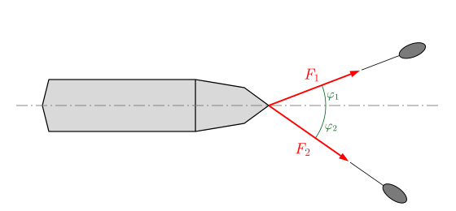
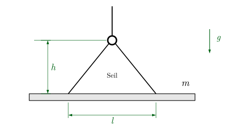
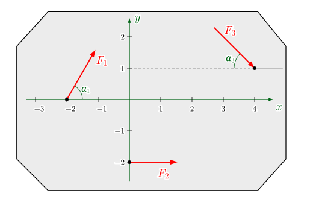
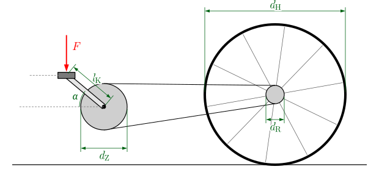
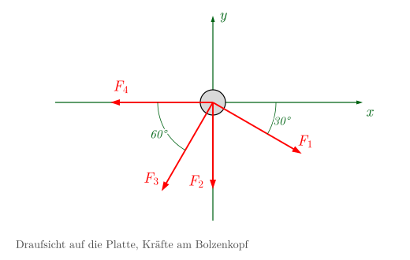
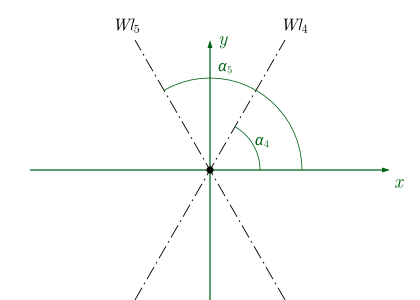
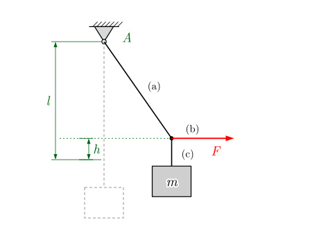

::: {.content-visible when-format="html"}
::: {.merke}
**So arbeiten Sie mit diesem Blatt**

1. Lösen Sie die Aufgaben **auf Papier**: Skizze, Freikörperbild, Koordinatensystem, Gleichungen.
   [Aufgabenblatt als PDF](01-grundlagen.pdf)
2. **Kontrollieren** Sie Ihre Ergebnisse mit dem
   [interaktiven Notebook](../notebooks/grundlagen/index.html){target="_blank"}
   oder mit den Ergebnissen unten.
3. Ändern Sie im Notebook Kräfte und Winkel und sagen Sie die Wirkung **vorher** voraus.
:::
:::

Winkel werden, wenn nicht anders angegeben, von der positiven $x$-Achse aus gegen den Uhrzeigersinn
gemessen. Momente zählen gegen den Uhrzeigersinn positiv.

## Seminaraufgaben

### Aufgabe 1.1 · Containerschiff mit zwei Schleppern

{width=70%}

Zwei Schlepper ziehen ein Containerschiff in den Hafen. Das Schiff soll geradeaus entlang der
eingezeichneten Wirkungslinie gezogen werden.

a) Welcher Winkel $\varphi_1$ ist erforderlich?
b) Wie groß ist die resultierende Kraft auf das Schiff?

**Gegeben:** $F_1$ = 0,8 MN, $F_2$ = 0,5 MN, $\varphi_2$ = 35°

### Aufgabe 1.2 · Stahlträger am Kran

{width=55%}

Ein Stahlträger der Masse $m$ wird von einem Kran gehoben. Das Seil ist symmetrisch befestigt,
der Träger hängt waagerecht. Bestimmen Sie die Seilkraft $F_S$.

**Gegeben:** $m$ = 450 kg, $l$ = 2,5 m, $h$ = 1,5 m, $g$ = 9,81 m/s²

*Hinweis: Schneiden Sie den Kranhaken frei.*

### Aufgabe 1.3 · Scheibe mit drei Kräften

{width=65%}

Auf eine starre Scheibe wirken drei Kräfte. Die Maße der Skizze sind in m angegeben.

a) Betrag $F_R$ und Winkel $\alpha_R$ der Resultierenden
b) resultierendes Moment $M_R^{(0)}$ um den Koordinatenursprung
c) Gleichung der Wirkungslinie der Resultierenden; zeichnen Sie sie in die Skizze ein.

**Gegeben:** $F_1$ = 2000 N, $\alpha_1$ = 60°, $F_2$ = 1500 N, $F_3$ = 2000 N, $\alpha_3$ = 45°

### Aufgabe 1.4 · Fahrradantrieb

{width=75%}

An der Tretkurbel wirkt die Kraft $F$ senkrecht nach unten. Kettenblatt und Ritzel haben die
Durchmesser $d_Z$ und $d_R$, das Hinterrad den Durchmesser $d_H$.

a) Moment $M_T$ auf die Tretkurbelwelle
b) Kettenkraft $F_K$
c) Moment $M_R$ auf die Ritzelwelle
d) Vortriebskraft $F_V$ des Hinterrads auf die Straße

**Gegeben:** $F$ = 500 N, $\alpha$ = 40°, $l_K$ = 180 mm, $d_Z$ = 150 mm, $d_R$ = 72 mm, $d_H$ = 730 mm

*Hinweis: Reibung in den Lagern und Rollwiderstand werden vernachlässigt.*



## Hausaufgaben

### Aufgabe 1.5 · Bolzen mit vier Kräften

{width=60%}

Ein Bolzen wird durch die vier in der $x$-$y$-Ebene liegenden Kräfte $F_1$ bis $F_4$ beansprucht.
Bestimmen Sie Betrag und Richtung der Resultierenden, rechnerisch und mit einem maßstäblichen Krafteck.

**Gegeben:** $F_1$ = 1000 N, $F_2$ = 500 N, $F_3$ = 1500 N, $F_4$ = 800 N

### Aufgabe 1.6 · Gleichgewicht mit zwei vorgegebenen Wirkungslinien

{width=50%}

Die Kräftegruppe $\vec F_1$, $\vec F_2$, $\vec F_3$ greift im Ursprung an. Sie soll durch zwei Kräfte
$\vec F_4$ und $\vec F_5$ ins Gleichgewicht gebracht werden, deren Wirkungslinien $Wl_4$ und $Wl_5$
gegeben sind. Bestimmen Sie $F_4$ und $F_5$ und deuten Sie die Vorzeichen.

**Gegeben:**
$\vec F_1 = (30\ \text{N},\ 20\ \text{N})$,
$\vec F_2 = (20\ \text{N},\ -30\ \text{N})$,
$\vec F_3 = (-10\ \text{N},\ -20\ \text{N})$,
$\alpha_4$ = 60°, $\alpha_5$ = 120°

### Aufgabe 1.7 · Kiste an Stricken (zum Weiterdenken, mit Notebook)

{width=50%}

Eine Kiste der Masse $m$ wird mit den Stricken (a), (b) und (c) durch die waagerechte Kraft $F$
angehoben. Jeder Strick hält höchstens die Zugkraft $S_\text{max}$ aus.

a) Auf welche Höhe $h_1$ wird die Kiste mit der Kraft $F_1$ gehoben?
b) Welche Höhe $h_\text{max}$ ist erreichbar, bevor Strick (a) reißt?
c) Welche Kraft $F_\text{max}$ ist dafür nötig?

**Gegeben:** $m$ = 50 kg, $l$ = 0,8 m, $F_1$ = 300 N, $S_\text{max}$ = 1,2 kN, $g$ = 9,81 m/s²

*Im Notebook können Sie $F$ verändern und beobachten, wie Auslenkung und Seilkraft wachsen.*

::: {.content-visible when-format="html"}

## Ergebnisse zur Kontrolle

::: {.callout-tip collapse="true"}
## Aufgabe 1.1
$\varphi_1 = 21{,}0^\circ$ (aus $F_1\sin\varphi_1 = F_2\sin\varphi_2$) · $F_R = 1{,}156\,\text{MN}$
:::

::: {.callout-tip collapse="true"}
## Aufgabe 1.2
Seilneigung gegen die Waagerechte: $\tan\beta = 2h/l$, $\beta = 50{,}2^\circ$ ·
$F_S = \dfrac{m g}{2\sin\beta} = 2873\,\text{N}$
:::

::: {.callout-tip collapse="true"}
## Aufgabe 1.3
$F_{Rx} = 3914\,\text{N}$, $F_{Ry} = 318\,\text{N}$ · $F_R = 3927\,\text{N}$, $\alpha_R = 4{,}64^\circ$ ·
$M_R^{(0)} = -7535\,\text{Nm}$ (im Uhrzeigersinn) ·
Wirkungslinie $y_R = 0{,}081\,x_R + 1{,}925\,\text{m}$
:::

::: {.callout-tip collapse="true"}
## Aufgabe 1.4
$M_T = F\,l_K\cos\alpha = 68{,}9\,\text{Nm}$ · $F_K = 919\,\text{N}$ · $M_R = 33{,}1\,\text{Nm}$ ·
$F_V = 90{,}7\,\text{N}$
:::

::: {.callout-tip collapse="true"}
## Aufgabe 1.5 (Hausaufgabe)
$F_{Rx} = -684\,\text{N}$, $F_{Ry} = -2299\,\text{N}$ · $F_R = 2399\,\text{N}$ ·
$\alpha_R = 253{,}4^\circ$ (III. Quadrant)
:::

::: {.callout-tip collapse="true"}
## Aufgabe 1.6 (Hausaufgabe)
$F_4 = -22{,}7\,\text{N}$, $F_5 = 57{,}3\,\text{N}$ (Kräfte in Richtung $\alpha_4$ bzw. $\alpha_5$ gezählt).
Das Minuszeichen heißt: $\vec F_4$ zeigt nach links unten.
:::

::: {.callout-tip collapse="true"}
## Aufgabe 1.7
$h_1 = 0{,}118\,\text{m}$ · $h_\text{max} = 0{,}473\,\text{m}$ · $F_\text{max} = 1095\,\text{N}$
:::

Aufgaben 1.1–1.4 und 1.7 nach S. Götz, <em>Aufgaben zur Technischen Mechanik</em>,
HTW Berlin (2023), Nr. 1.1.3, 1.1.4, 1.2.1, 1.2.4, 1.1.5 – mit freundlicher Genehmigung; Grafiken neu gezeichnet.

:::

::: {.content-visible when-format="typst"}
*Ergebnisse zur Kontrolle und ein interaktives Notebook finden Sie auf der Kurswebseite.*
Aufgaben 1.1–1.4 und 1.7 nach S. Götz, Aufgaben zur Technischen Mechanik, HTW Berlin (2023), mit freundlicher Genehmigung.
:::
