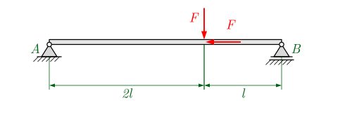
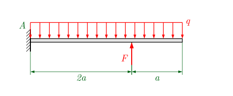
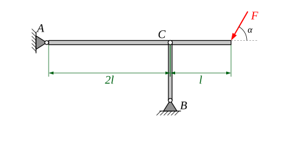
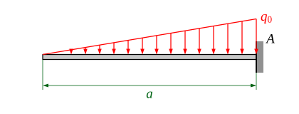
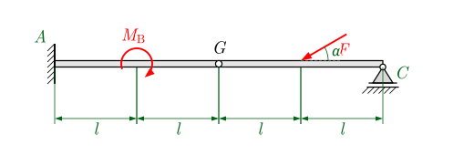

::: {.content-visible when-format="html"}
::: {.merke}
**So arbeiten Sie mit dieser Aufgabensammlung**

1. Lösen Sie die Aufgaben **auf Papier**: Freikörperbild, Bereiche, Gleichgewicht, Verläufe skizzieren.
   [Aufgabenblatt als PDF](03-schnittgroessen.pdf)
2. **Kontrollieren** Sie Ihre Ergebnisse mit den Ergebnissen unten.
3. Im [interaktiven Notebook](../notebooks/schnittgroessen/index.html){target="_blank"} können Sie
   Lasten verändern. Sagen Sie die Wirkung **vorher** voraus.
:::
:::

Vorzeichenkonvention wie in der Vorlesung: $N$ positiv als Zug, $Q$ am positiven Schnittufer in $+z$
(nach unten), $M$ positiv, wenn die untere Faser auf Zug beansprucht wird.

## Aufgaben

### Aufgabe 3.1 · Träger mit zwei Einzelkräften

{width=70%}

Ermitteln Sie die Lagerreaktionen und die Verläufe $N(x)$, $Q(x)$ und $M(x)$.

**Gegeben:** $F$ = 100 N, $l$ = 80 cm

### Aufgabe 3.2 · Kragträger mit Streckenlast

{width=65%}

Ermitteln Sie die Verläufe $N(x)$, $Q(x)$ und $M(x)$ sowie Ort und Größe des größten Biegemoments.

**Gegeben:** $F$ = 1250 N, $q$ = 3 N/cm, $a$ = 1,68 m

### Aufgabe 3.3 · Träger mit Pendelstütze

{width=70%}

Der Träger ist in $A$ gelagert und in $C$ von einer Pendelstütze gehalten.
Ermitteln Sie die Kraft in der Stütze sowie $N(x)$, $Q(x)$ und $M(x)$ im Träger.

**Gegeben:** $F$ = 30 kN, $l$ = 1 m, $\alpha$ = 60°



### Aufgabe 3.4 · Kragträger mit Dreieckslast

{width=55%}

Ermitteln Sie $Q(x)$ und $M(x)$. Lösen Sie die Aufgabe zweimal: einmal mit der **Schnittmethode**
und einmal durch **Integration** der Differentialbeziehungen $Q' = -q$, $M' = Q$.

**Gegeben:** $q_0$, $a$

### Aufgabe 3.5 · Gelenkträger

{width=75%}

Der Träger hat in $G$ ein Gelenk.

a) Bestimmen Sie die Lagerreaktionen und die Gelenkkräfte.
b) Ermitteln Sie die Verläufe $N(x)$, $Q(x)$ und $M(x)$.

**Gegeben:** $F$ = 3000 N, $M_B$ = 500 Nm, $l$ = 1,5 m, $\alpha$ = 30°

*Hinweis: Was gilt für das Biegemoment im Gelenk?*

::: {.content-visible when-format="html"}

## Ergebnisse zur Kontrolle

::: {.callout-tip collapse="true"}
## Aufgabe 3.1
$F_{AH} = 100\,\text{N}$ (nach rechts), $F_{AV} = 33{,}3\,\text{N}$, $F_B = 66{,}7\,\text{N}$

$N = -100\,\text{N}$ zwischen $A$ und Kraftangriff, sonst $0$ ·
$Q = 33{,}3\,\text{N}$ bzw. $-66{,}7\,\text{N}$ ·
$M_\text{max} = 53{,}3\,\text{Nm}$ am Kraftangriffspunkt
:::

::: {.callout-tip collapse="true"}
## Aufgabe 3.2
Einspannung: $F_{AV} = 262\,\text{N}$ (nach oben), Schnittmoment $M(0) = 390\,\text{Nm}$

$Q$: $262\,\text{N} \to -746\,\text{N}$ (vor $F$), Sprung auf $504\,\text{N}$, dann $\to 0$

$M_\text{max} = 504\,\text{Nm}$ bei $x = 0{,}873\,\text{m}$; $M(2a) = -423\,\text{Nm}$
:::

::: {.callout-tip collapse="true"}
## Aufgabe 3.3
Stützenkraft $S = -39{,}0\,\text{kN}$ (Druck), $F_{AH} = 15\,\text{kN}$, $F_{AV} = -13{,}0\,\text{kN}$ (also nach unten)

$N = -15\,\text{kN}$ · $Q = -13{,}0\,\text{kN}$ bzw. $26{,}0\,\text{kN}$ · $M_C = -26{,}0\,\text{kNm}$
:::

::: {.callout-tip collapse="true"}
## Aufgabe 3.4
An der Einspannung: $Q = -\tfrac12\,q_0 a$, $M = -\tfrac16\,q_0 a^2$
:::

::: {.callout-tip collapse="true"}
## Aufgabe 3.5
$F_{AH} = 2598\,\text{N}$, $F_{AV} = 750\,\text{N}$, $|M_A| = 2750\,\text{Nm}$, $F_C = 750\,\text{N}$,
Gelenkkräfte $G_H = 2598\,\text{N}$, $G_V = 750\,\text{N}$ (Beträge)

Im Gelenk ist $M = 0$.
:::

Aufgaben nach S. Götz, <em>Aufgaben zur Technischen Mechanik</em>, HTW Berlin (2023),
Nr. 1.5.1, 1.5.6, 1.5.3, 1.5.8, 1.5.5 – mit freundlicher Genehmigung; Grafiken neu gezeichnet.

:::

::: {.content-visible when-format="typst"}
*Ergebnisse zur Kontrolle und ein interaktives Notebook finden Sie auf der Kurswebseite.*
Aufgaben nach S. Götz, Aufgaben zur Technischen Mechanik, HTW Berlin (2023), mit freundlicher Genehmigung.
:::
